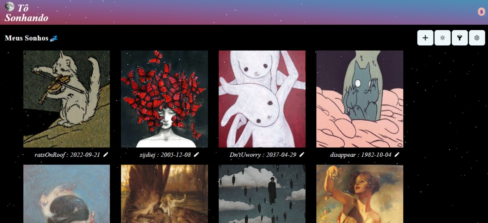
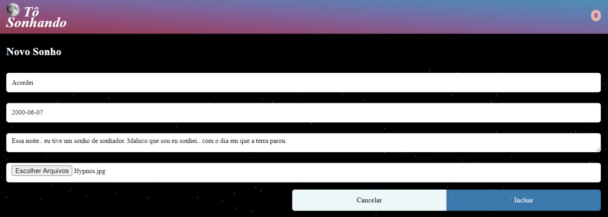

# WebApp-DreamOn
Trabalho da universidade feito em Javascript, CSS e Html destinado a armazenar sonhos dos usuários.

**1. Nome da aplicação:** Tô Sonhando / DreamOn

**2. Autor:** João Lucas Bryan G. Duarte.

**3. O que a aplicação faz:** O app possibilita aos usuários realizarem uma gestão de seus sonhos, contando com recursos de adicionar, excluir, editar, e filtrar de acordo com a data. A aplicação ainda apresenta recursos visuais como: ativar modo escuro e claro e alterar as cores do fundo e da barra de navegação. 

A motivação por tras deste projeto é a significância que os sonhos possuem para o autoconhecimento e qualidade de vida, visto que podem representar sentimentos que se encontram no âmago das pessoas, e, portanto, apresentarem alto potencial para análises.

**4. Descrição das interfaces:**

**4.1. Interface 1 em modo escuro**

**4.1.2. Interface 1 em modo claro**

Esta interface é apresentada quando a lista de sonhos se encontra vazia. O gif apresentado se altera de acordo com um método rândomico, trazendo diversidade para a aplicação.

O usuário pode selecionar o modo de tela que mais lhe agradar (escuro ou claro), clicando no 2° botão, simbolizado por um sol ou uma lua.

**4.1.2. Interface 1 com conteudo**

Assim fica a tela principal quando a lista de sonhos está com itens. Neste caso tem-se a possibilidade de clicar na imagem do sonho em questão para ver a descrição, como na imagem abaixo:

**4.2. Interface Sonho**

Vale destacar que antes de clicar neste sonho eu apertei no incone de engrenagem, que tornou visível as duas opções que podem ser observadas no canto inferior esquerdo, responsáveis pela mudança nas cores do fundo e da barra.

**4.3. Interface Alteração**

Como mostrado na Home, quando há sonhos, um botão com simbolo de edição aparece junto com cada sonho, de modo que se for clicado a interface de alteração de sonho é aberta:

É possivel alterar os dados e também excluir o sonho nesta tela.

**4.4 Interface de adição de sonho**

Esta interface torna-se visível quando o usuário clica no botão de adicionar um novo sonho. Nela é possivel o usuário adicionar o titulo, a data, descrição, e também uma imagem relacionada com o sonho.

**5. O que a lista armazena:** A lista 'sonhos' armazena uma id de identificação do sonho, o título, descricao e a data em que o sonho ocorreu. Ademais, conta ainda com uma imagem que o usuário pode adicionar que represente o sonho em questão.

**6. QUESTIONÁRIO (Sim/Não):**

**6.1. A aplicação é original e não uma cópia da aplicação de um colega ou de uma aplicação já existente?**
R: Sim.

**6.2. A aplicação tem pelo menos duas interfaces (telas ou páginas) independentes?**
R: Sim.

**6.3. A aplicação armazena e usa de forma relevante dados complexos (mais de um atributo)?**
R: Sim.

**6.4. A aplicação possui um manifesto para instalação no dispositivo do usuário?**
R: Sim.

**6.5 A aplicação possui um service worker que permite o funcionamento off-line?**
R: Sim.

**6.6. O código da minha aplicação possui comentários explicando cada operação?**
R: Não.

**6.7. A aplicação está funcionando corretamente?**
R: Sim.

**6.8. A aplicação está completa?**
R: Sim, porém algumas coisas podem ser melhoradas.

